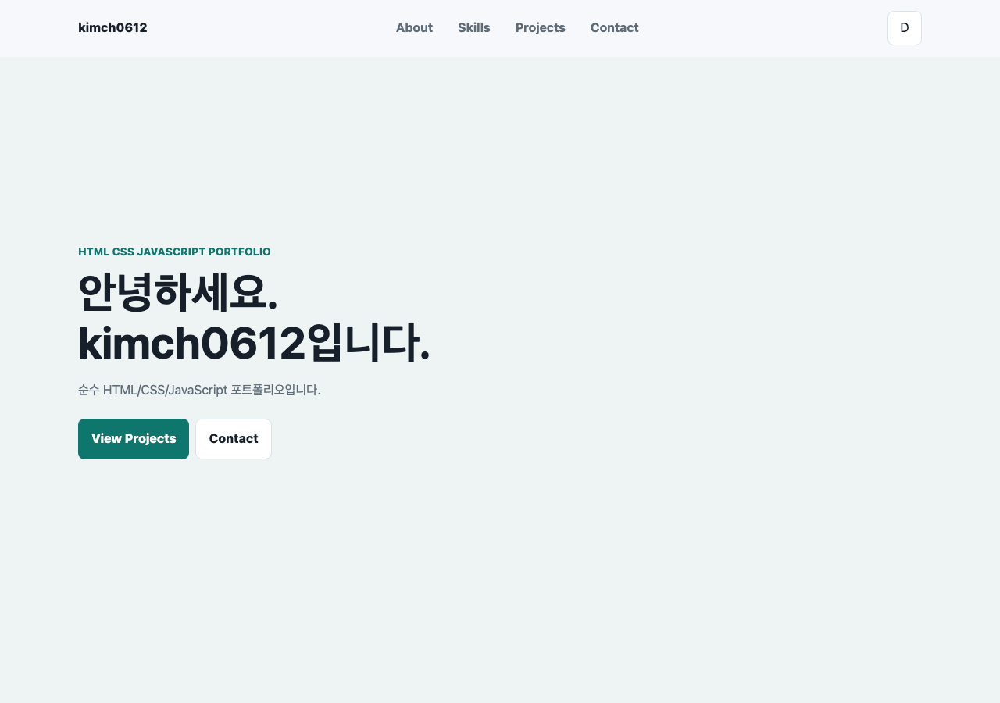
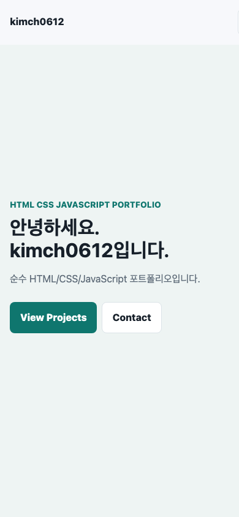
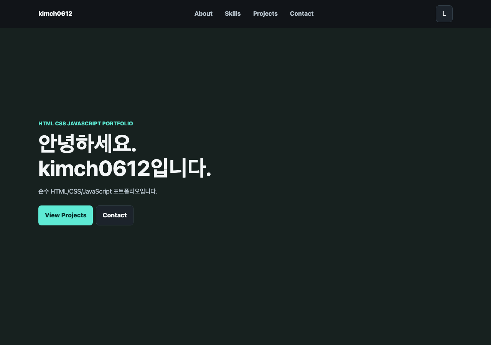

# 웹 기초 완성, 나만의 포트폴리오 구축

순수 HTML, CSS, JavaScript만으로 구현한 반응형 포트폴리오 웹사이트입니다. 프레임워크 없이 DOM 이벤트, 상태 변경, 화면 렌더링 흐름을 직접 다루고 GitHub API를 연동해 공개 저장소를 동적으로 표시합니다.

이 프로젝트의 핵심 학습 목표는 다음 흐름을 이해하는 것입니다.

```text
사용자 이벤트 -> 상태 변경 -> DOM 업데이트 -> 화면 변화
```

## 배포 URL

- GitHub Pages: https://kimch0612.github.io/Codyssey_Subject4_B4-1/
- Repository: https://github.com/kimch0612/Codyssey_Subject4_B4-1

## 사용 기술

- HTML5 시맨틱 마크업
- CSS3 변수, Flexbox, Grid, 반응형 디자인
- JavaScript ES6+
- GitHub REST API
- localStorage
- Intersection Observer

## 주요 기능

- 모바일, 태블릿, 데스크톱 반응형 레이아웃
- 모바일 햄버거 메뉴
- 네비게이션 앵커 기반 부드러운 스크롤
- 스크롤 위치에 따른 헤더 스타일 변경
- 스크롤 탑 버튼
- 다크 모드 토글 및 localStorage 저장
- Intersection Observer 기반 스크롤 애니메이션
- GitHub API 저장소 목록 동적 렌더링
- Projects 섹션의 로딩, 성공, 에러, 빈 상태 UI
- Contact 폼 필수값 및 이메일 형식 검증

## 구현 기준값

- 스크롤 탑 버튼 표시 기준: `300px`
- 네비게이션 배경 변경 기준: `60px`
- Intersection Observer threshold: `0.2`
- GitHub API 엔드포인트: `https://api.github.com/users/kimch0612/repos`
- localStorage key: `portfolio-theme`

## 프로젝트 구조

```text
.
├── index.html
├── css/
│   └── style.css
├── js/
│   ├── script.js
│   └── script_ex.js
├── images/
│   ├── profile.svg
│   ├── screenshot-desktop.png
│   ├── screenshot-mobile.png
│   └── screenshot-dark.png
├── README.md
└── Study.md
```

## 파일 분리와 역할

프로젝트는 HTML, CSS, JavaScript를 역할별로 분리했습니다.

```text
index.html      화면의 구조와 의미
css/style.css   화면의 모양, 레이아웃, 반응형 스타일
js/script.js    사용자 이벤트, 상태 변경, API 호출, DOM 업데이트
```

이렇게 분리한 이유는 각 파일의 책임을 명확하게 나누기 위해서입니다. HTML은 어떤 콘텐츠가 있는지 표현하고, CSS는 그 콘텐츠를 어떻게 보여줄지 담당하며, JavaScript는 사용자 행동에 반응해 상태와 DOM을 변경합니다. 역할을 분리하면 코드가 길어져도 수정 위치를 찾기 쉽고, 구조와 디자인과 동작이 서로 섞이는 것을 줄일 수 있습니다.

## HTML 구조와 시맨틱 마크업

페이지는 의미 단위에 맞춰 시맨틱 태그를 사용했습니다.

```text
header  페이지 상단 고정 영역
nav     주요 섹션으로 이동하는 네비게이션
main    페이지의 핵심 콘텐츠
section Hero, About, Skills, Projects, Contact 영역
article 독립적인 카드 콘텐츠
footer  페이지 하단 정보와 링크
```

`section`은 Hero, About, Skills, Projects, Contact처럼 페이지 안에서 구분되는 큰 영역에 사용했습니다. `article`은 Skills 카드와 Projects 카드처럼 하나만 따로 보아도 독립적으로 이해 가능한 콘텐츠에 사용했습니다. 폼 입력 요소는 `label for`와 `input id`를 연결해 클릭 영역과 접근성을 개선했고, 이미지에는 `alt`를 작성해 이미지가 보이지 않거나 스크린 리더를 사용할 때도 의미가 전달되도록 했습니다.

## CSS 설계

### CSS 변수

`:root`에 색상, 간격, 그림자, 최대 너비 같은 값을 CSS 변수로 정의했습니다.

```css
:root {
  --color-bg: #f7f8fb;
  --color-primary: #0f766e;
  --shadow: 0 14px 30px rgba(23, 32, 42, 0.1);
}
```

CSS 변수를 사용하면 반복되는 값을 한 곳에서 관리할 수 있습니다. 예를 들어 배경색이나 주요 색상을 바꾸고 싶을 때 여러 선택자를 일일이 수정하지 않고 변수 값만 바꾸면 됩니다. 다크 모드도 같은 방식으로 구현했습니다. JavaScript가 `<html>`의 `data-theme` 값을 바꾸면 CSS의 `[data-theme="dark"]` 규칙이 적용되고, 변수 값이 바뀌면서 전체 화면 색상이 함께 변경됩니다.

### Flexbox와 Grid

네비게이션에는 Flexbox를 사용했습니다.

```css
.navbar {
  display: flex;
  align-items: center;
  justify-content: space-between;
}
```

네비게이션은 로고, 메뉴, 버튼을 한 줄 방향으로 정렬하는 구조입니다. 그래서 한 방향 배치에 강한 Flexbox가 적합합니다. 로고는 왼쪽, 메뉴와 버튼 영역은 오른쪽에 배치되도록 `justify-content: space-between`을 사용했습니다.

Projects 카드 목록에는 Grid를 사용했습니다.

```css
.projects-grid {
  display: grid;
  grid-template-columns: repeat(auto-fit, minmax(260px, 1fr));
}
```

Projects는 여러 카드를 행과 열로 배치해야 하므로 2차원 레이아웃에 강한 Grid가 적합합니다. `auto-fit`과 `minmax(260px, 1fr)`를 사용해 화면이 넓으면 여러 열로, 좁으면 한 열로 자동 전환되도록 했습니다.

### 모바일 퍼스트 반응형

기본 스타일은 모바일 화면을 기준으로 작성하고, 화면이 넓어질 때 `@media (min-width: 768px)`, `@media (min-width: 1024px)`에서 레이아웃을 확장했습니다.

```text
기본 스타일      모바일
768px 이상       태블릿 이상
1024px 이상      데스크톱
```

모바일 퍼스트로 작성한 이유는 가장 좁은 화면에서 콘텐츠가 먼저 안정적으로 보여야 하기 때문입니다. 작은 화면에서 한 열 구조와 햄버거 메뉴를 먼저 구성하고, 넓은 화면에서는 메뉴를 가로 배치하고 카드 열 수를 늘리는 방식으로 확장했습니다.

## JavaScript 설계

### defer 사용

JavaScript 파일은 `defer` 속성으로 연결했습니다.

```html
<script src="js/script.js" defer></script>
```

`defer`를 사용하면 HTML 파싱을 막지 않고 JavaScript 파일을 내려받고, DOM이 준비된 뒤 스크립트가 실행됩니다. 이 프로젝트는 `querySelector`로 HTML 요소를 찾기 때문에 DOM이 만들어진 뒤 실행되는 것이 중요합니다.

### DOM 선택과 이벤트 연결

HTML에 `onclick` 같은 인라인 이벤트 속성을 쓰지 않고, JavaScript에서 `addEventListener`로 이벤트를 연결했습니다.

```js
themeButton.addEventListener("click", changeTheme);
menuButton.addEventListener("click", changeMenu);
contactForm.addEventListener("input", changeField);
contactForm.addEventListener("submit", submitForm);
window.addEventListener("scroll", renderScrollUI);
```

`onclick`을 HTML에 직접 쓰면 구조와 동작이 섞입니다. 반면 `addEventListener`를 사용하면 HTML은 구조만 담당하고, JavaScript는 동작만 담당하게 되어 역할이 분리됩니다. 또한 이벤트 연결을 `bindEvents()` 함수에 모아 두어 어떤 사용자 행동을 처리하는지 한눈에 볼 수 있습니다.

## 상태 관리 패턴

현재 화면을 결정하는 값은 `state` 객체에 모았습니다.

```js
const state = {
  theme: localStorage.getItem(THEME_KEY) || "light",
  menuOpen: false,
  projectStatus: "idle",
  projects: [],
  projectError: "",
  formErrors: {
    name: "",
    email: "",
    message: "",
  },
};
```

상태 객체를 따로 둔 이유는 화면을 결정하는 값을 한 곳에서 관리하기 위해서입니다. 단순히 DOM을 바로바로 수정하면 현재 화면이 어떤 상태인지 코드 전체에 흩어질 수 있습니다. 이 프로젝트는 먼저 `state` 값을 바꾸고, 그 다음 `renderTheme()`, `renderMenu()`, `renderProjects()`, `renderFieldError()` 같은 렌더 함수를 호출해 화면에 반영합니다.

### 상태 흐름 예시

다크 모드 흐름:

```text
테마 버튼 클릭
-> changeTheme()
-> state.theme 변경
-> localStorage 저장
-> renderTheme()
-> html data-theme 변경
-> CSS 변수 변경
-> 전체 화면 색상 변경
```

Projects API 흐름:

```text
페이지 로드 또는 Refresh 클릭
-> loadProjects()
-> state.projectStatus = "loading"
-> renderProjects()로 로딩 UI 표시
-> fetch로 GitHub API 요청
-> 성공 시 state.projects 저장, success 또는 empty 상태 설정
-> 실패 시 error 상태와 projectError 저장
-> renderProjects()로 상태별 UI 표시
```

폼 검증 흐름:

```text
사용자 입력
-> input 이벤트
-> changeField()
-> validateField()
-> state.formErrors 변경
-> renderFieldError()
-> 에러 메시지 표시 또는 숨김
```

모바일 메뉴 흐름:

```text
햄버거 버튼 클릭
-> changeMenu()
-> state.menuOpen 값 반전
-> renderMenu()
-> active 클래스 추가 또는 제거
-> 메뉴 열림 또는 닫힘
```

## API 연동과 비동기 처리

GitHub 저장소 목록은 `fetch`와 `async/await`로 가져옵니다.

```js
const response = await fetch(`https://api.github.com/users/${GITHUB_USERNAME}/repos`);
const repos = await response.json();
```

`fetch()`는 비동기 요청을 보내고 Promise를 반환합니다. `await`를 사용하면 브라우저 전체를 멈추는 것이 아니라, `loadProjects()` 함수 안에서만 응답이 끝날 때까지 다음 줄 실행을 기다립니다. `response.json()`도 Promise를 반환하므로 `await`를 사용해야 실제 저장소 배열을 받아 정렬하고 렌더링할 수 있습니다.

에러 처리는 `try/catch`로 분리했습니다.

```js
try {
  const response = await fetch(...);

  if (!response.ok) {
    throw new Error(state.projectError);
  }

  const repos = await response.json();
  ...
} catch (error) {
  state.projectStatus = "error";
  state.projectError = state.projectError || error.message || "프로젝트를 불러올 수 없습니다.";
}
```

HTTP 응답이 왔더라도 `response.ok`가 `false`이면 성공으로 보지 않고 에러 상태로 전환합니다. 실패 시에는 에러 메시지와 재시도 버튼을 보여주고, 재시도 버튼은 다시 `loadProjects()`를 실행합니다.

Projects 섹션은 다음 네 가지 상태를 UI로 표현합니다.

```text
loading  프로젝트를 불러오는 중입니다...
success  GitHub 저장소 카드 목록
error    에러 메시지와 다시 시도 버튼
empty    표시할 프로젝트가 없습니다.
```

## 배열 메서드와 데이터 변환

GitHub API에서 받은 저장소 배열은 카드 HTML로 변환되어 화면에 렌더링됩니다.

```js
projectsGrid.innerHTML = state.projects.map(makeProjectCard).join("");
```

단계별 흐름은 다음과 같습니다.

```text
state.projects
-> map(makeProjectCard)
-> 저장소 객체 1개를 카드 HTML 문자열 1개로 변환
-> join("")
-> 여러 카드 문자열을 하나의 HTML 문자열로 합침
-> innerHTML
-> Projects 영역에 카드 목록 표시
```

`forEach()`는 여러 요소에 같은 처리를 할 때 사용했습니다. 예를 들어 모든 스크롤 링크에 클릭 이벤트를 연결하고, 모든 reveal 섹션을 Intersection Observer에 등록할 때 사용합니다.

```js
scrollLinks.forEach((link) => link.addEventListener("click", moveToSection));
revealSections.forEach((section) => observer.observe(section));
```

`sort()`는 저장소를 최신 업데이트 순으로 정렬할 때 사용했습니다.

```js
const sortedRepos = [...repos].sort(
  (firstRepo, secondRepo) => new Date(secondRepo.updated_at) - new Date(firstRepo.updated_at),
);
```

`filter()`를 이용한 프로젝트 필터 기능은 선택 항목이므로 현재 구현에는 포함하지 않았습니다.

## 인터랙션 구현

### 햄버거 메뉴

모바일에서 햄버거 버튼을 클릭하면 `changeMenu()`가 `state.menuOpen` 값을 반전시키고, `renderMenu()`가 `navMenu.classList.toggle("active", state.menuOpen)`으로 메뉴 표시 여부를 반영합니다. 메뉴가 열린 상태에서 데스크톱 크기로 확장해도 메뉴가 가로 배치되도록 미디어 쿼리에서 `.nav-menu.active`도 `display: flex`로 처리했습니다.

### 부드러운 스크롤

`data-scroll-link`가 붙은 링크를 클릭하면 `moveToSection()`이 실행됩니다. 기본 앵커 이동은 `event.preventDefault()`로 막고, `scrollIntoView({ behavior: "smooth", block: "start" })`로 해당 섹션까지 부드럽게 이동합니다.

### 스크롤 탑 버튼과 헤더 변경

`renderScrollUI()`는 `window.scrollY`를 기준으로 클래스를 토글합니다.

```js
header.classList.toggle("scrolled", window.scrollY >= HEADER_CHANGE_POINT);
scrollTopButton.classList.toggle("visible", window.scrollY >= SCROLL_TOP_POINT);
```

60px 이상 스크롤하면 헤더에 배경과 그림자가 생기고, 300px 이상 스크롤하면 Top 버튼이 나타납니다.

### 스크롤 애니메이션

`.reveal` 요소는 처음에 투명하고 아래로 내려간 상태입니다. Intersection Observer가 요소 진입을 감지하면 `is-visible` 클래스를 추가하고, CSS transition으로 자연스럽게 나타납니다.

모바일에서 Projects 섹션처럼 매우 긴 섹션은 섹션 전체의 20%가 한 화면에 들어오기 어려울 수 있습니다. 그래서 `shouldRevealSection()`에서 일반 섹션은 `0.2` 기준을 사용하고, 너무 긴 섹션은 화면에 들어온 시점에 표시되도록 보완했습니다.

## 폼 검증

Contact 폼은 이름, 이메일, 메시지 필드를 가집니다.

```text
name     필수 입력
email    필수 입력 + 이메일 형식 검증
message  필수 입력
```

`validateField()`는 빈 값이면 `"필수 입력 항목입니다."`를 반환하고, 이메일 형식이 맞지 않으면 `"올바른 이메일 형식을 입력해 주세요."`를 반환합니다. `renderFieldError()`는 각 입력 필드 근처의 `data-error-for` 요소에 에러 메시지를 표시하고, 입력 필드에 `is-invalid` 클래스를 추가하거나 제거합니다.

폼 제출 시에는 `submitForm()`에서 `event.preventDefault()`로 기본 제출 동작을 막고, `checkForm()`으로 전체 필드를 검사합니다. 모든 에러 메시지가 빈 문자열이면 성공 메시지를 표시하고 폼을 초기화합니다.

## 스크린샷

### 데스크톱



### 모바일



### 다크 모드


